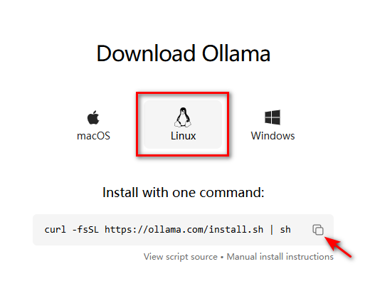
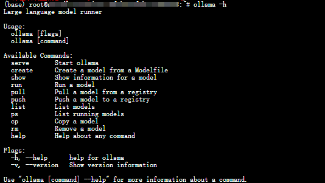
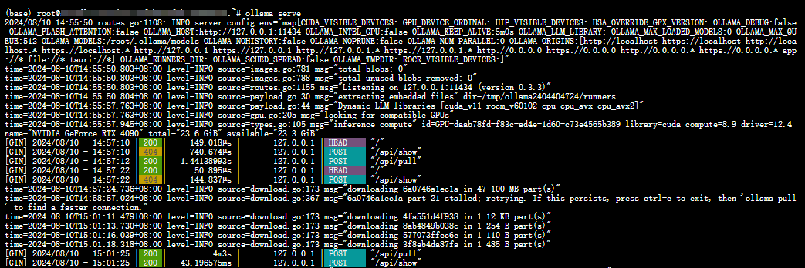

# Ollama安装与配置-Linux系统篇

## 简介

本节学习如何在Linux系统中完成Ollama的安装与配置，以及对Ollama更新，特定版本的安装，查看日志和卸载。

## 一、快速安装

> [**Ollama**](https://ollama.com/download)官方主页：https://ollama.com/library
> **Ollama**官方GitHub源代码仓库：[https://github.com/ollama/ollama/](https://github.com/ollama/ollama)
>
> 官网提供了一条命令行快速安装的方法



```shell
curl -fsSL https://ollama.com/install.sh | sh
```


此命令将自动下载最新版本的Ollama并完成安装，以下是ollama使用常见的指令：

```bash

ollama serve         #启动ollama
ollama create        #从模型文件创建模型
ollama show          #显示模型信息
ollama run           #运行模型
ollama pull          #从注册表中拉取模型
ollama push          #将模型推送到注册表
ollama list          #列出模型
ollama cp            #复制模型
ollama rm            #删除模型
ollama help          #获取有关任何命令的帮助信息
```

- 验证安装完成，在 `Exec`处输入：

```bash
ollama -h
```

输出如下：即表示安装成功🎉



- 开启并使用ollama

首先，在终端中开启ollama，并在后台挂起

```shell
ollama serve
```



>  [library (ollama.com)](https://ollama.com/library)这里是ollama的模型库，搜索你想要的模型，开启新的终端，启动！

```bash
ollama run llama3
```

> 下载速度取决于你的带宽，下载完毕即可使用✌记得使用 `control + D`退出聊天


## 二、手动安装

### 2.1 下载二进制文件 `ollama`

将ollama的二进制文件下载到 PATH 中的目录：

```shell
sudo curl -L https://ollama.com/download/ollama-linux-amd64 -o /usr/bin/ollama
sudo chmod +x /usr/bin/ollama
```

### 2.2 将 Ollama 添加为自启动服务（推荐）

首先，为 Ollama 创建用户：

```shell
sudo useradd -r -s /bin/false -m -d /usr/share/ollama ollama
```

然后在该位置：`/etc/systemd/system/ollama.service` 创建服务文件

```ini
[Unit]
Description=Ollama Service
After=network-online.target

[Service]
ExecStart=/usr/bin/ollama serve
User=ollama
Group=ollama
Restart=always
RestartSec=3

[Install]
WantedBy=default.target
```

最后启动服务：

```shell
sudo systemctl daemon-reload
sudo systemctl enable ollama
```

### 2.3 启动 Ollama

使用以下命令启动 Ollama：`systemd`

```shell
sudo systemctl start ollama
```

## 三、更新

再次运行之前的安装语句来更新 Ollama：

```shell
curl -fsSL https://ollama.com/install.sh | sh
```

或者下载 ollama 二进制文件：

```shell
sudo curl -L https://ollama.com/download/ollama-linux-amd64 -o /usr/bin/ollama
sudo chmod +x /usr/bin/ollama
```

## 四、安装特定版本

设置 `OLLAMA_VERSION`字段，，可以安装对应的版本

```
curl -fsSL https://ollama.com/install.sh | OLLAMA_VERSION=0.1.32 sh
```

## 五、查看日志

查看作为启动服务运行的 Ollama 的日志：

```shell
journalctl -e -u ollama
```

## 六、卸载

- 删除 Ollama 服务：

```shell
sudo systemctl stop ollama
sudo systemctl disable ollama
sudo rm /etc/systemd/system/ollama.service
```

- 从 bin 目录中删除 Ollama 二进制文件： `/usr/local/bin `,`/usr/bin` ,`/bin`

```shell
sudo rm $(which ollama)
```

- 删除下载的模型和 Ollama 服务用户和组：

```shell
sudo rm -r /usr/share/ollama
sudo userdel ollama
sudo groupdel ollama
```
