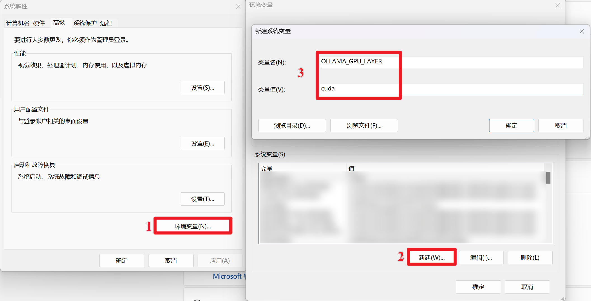

# Ollama 自定义在 GPU 中运行

## Windows

以下以 Windows 系统为例，介绍如何自定义在 GPU 中运行 Ollama。

Ollama 默认情况下使用 CPU 进行推理。为了获得更快的推理速度，可以配置 Ollama 使用的 GPU。本教程将指导如何在 Windows 系统上设置环境变量，以启用 GPU 加速。

### 前提条件

- 电脑有 NVIDIA 显卡。
- 已安装 NVIDIA 显卡驱动程序，可以使用命令 `nvidia-smi` 来检查驱动程序是否安装。
- 已安装 CUDA 工具包，可以使用命令 `nvcc --version` 来检查 CUDA 是否安装。

> [!TIP]
> 关于 NVIDIA 显卡驱动程序和 CUDA 工具包的安装，可以自行搜索相关教程，本文不再赘述。
> 如果你的电脑满足上述前提条件，在使用 Ollama 时，是默认使用 GPU 加速的。如果你想指定使用特定的 GPU，可以按照下面的步骤进行设置。

### 配置环境变量

1.  **打开系统环境变量设置**

    *   在 Windows 搜索栏中输入 "环境变量"，然后选择 "编辑系统环境变量"。
    *   在弹出的 "系统属性" 窗口中，点击 "高级" 选项卡，然后点击 "环境变量" 按钮。

2.  **创建 OLLAMA\_GPU\_LAYER 变量**

    *   在 "系统变量" 区域，点击 "新建" 按钮。
    *   在 "新建系统变量" 对话框中，输入以下信息：
        *   **变量名：** `OLLAMA_GPU_LAYER`
        *   **变量值：** `cuda`  (这将告诉 Ollama 使用 CUDA 进行 GPU 加速)
    *   点击 "确定" 保存变量。
    
    

3.  **(可选) 指定使用的 GPU**

    *   如果你的系统有多个 GPU，并且你想指定 Ollama 使用特定的 GPU，可以设置 `CUDA_VISIBLE_DEVICES` 环境变量。
    *   **查找 GPU 的 UUID：**  强烈建议使用 UUID 而不是编号，因为编号可能会因为驱动更新或系统重启而发生变化。
        *   打开命令提示符或 PowerShell。
        *   运行命令：`nvidia-smi -L`
        *   在输出中，找到想要使用的 GPU 的 "UUID" 值。  例如：`GPU 00000000:01:00.0` 下面的 `UUID : GPU-xxxxxxxx-xxxx-xxxx-xxxx-xxxxxxxxxxxx`。

           
  
    * **创建 CUDA\_VISIBLE\_DEVICES 变量：**
        *   在 "系统变量" 区域，点击 "新建" 按钮。
        *   在 "新建系统变量" 对话框中，输入以下信息：
            *   **变量名：** `CUDA_VISIBLE_DEVICES`
            *   **变量值：**  找到的 GPU 的 UUID。 例如：`GPU-xxxxxxxx-xxxx-xxxx-xxxx-xxxxxxxxxxxx`
        *   点击 "确定" 保存变量。


**重要：** 为了使环境变量生效，**重新启动 Ollama 运行的终端或应用程序**。

**验证 GPU 加速是否生效：**

1.  打开命令提示符。
2.  运行 Ollama。 例如： `ollama run deepseek-r1:1.5b`
3.  新开一个命令提示符窗口，使用 `ollama ps` 命令查看 Ollama 运行的进程。


## Linux

以下以 Linux 系统为例，介绍如何自定义在 GPU 中运行 Ollama。

1. 创建 `ollama_gpu_selector.sh` 脚本文件，内容如下：

```bash
#!/bin/bash

# Validate input
validate_input(){
if[[! $1 =~^[0-4](,[0-4])*$ ]];then
        echo "Error: Invalid input. Please enter numbers between 0 and 4, separated by commas."
exit1
fi
}

# Update the service file with CUDA_VISIBLE_DEVICES values
update_service(){
# Check if CUDA_VISIBLE_DEVICES environment variable exists in the service file
if grep -q '^Environment="CUDA_VISIBLE_DEVICES='/etc/systemd/system/ollama.service;then
# Update the existing CUDA_VISIBLE_DEVICES values
        sudo sed -i 's/^Environment="CUDA_VISIBLE_DEVICES=.*/Environment="CUDA_VISIBLE_DEVICES='"$1"'"/'/etc/systemd/system/ollama.service
else
# Add a new CUDA_VISIBLE_DEVICES environment variable
        sudo sed -i '/\[Service\]/a Environment="CUDA_VISIBLE_DEVICES='"$1"'"'/etc/systemd/system/ollama.service
fi

# Reload and restart the systemd service
    sudo systemctl daemon-reload
    sudo systemctl restart ollama.service

    echo "Service updated and restarted with CUDA_VISIBLE_DEVICES=$1"
}

# Check if arguments are passed
if["$#"-eq 0];then
# Prompt user for CUDA_VISIBLE_DEVICES values if no arguments are passed
    read -p "Enter CUDA_VISIBLE_DEVICES values (0-4, comma-separated): " cuda_values
    validate_input "$cuda_values"
    update_service "$cuda_values"
else
# Use arguments as CUDA_VISIBLE_DEVICES values
    cuda_values="$1"
    validate_input "$cuda_values"
    update_service "$cuda_values"
fi
```

2. 为脚本文件添加执行权限

```bash
chmod +x ollama_gpu_selector.sh
sudo ./ollama_gpu_selector.sh
```

运行脚本后，按照提示输入 GPU 编号，即可指定 Ollama 使用的 GPU。可以使用逗号分隔多个 GPU 编号，例如：`0,1,2`。

3. 重启 Ollama 服务

```bash
cat /etc/systemd/system/ollama.service
```

运行指令后，查看 Ollama 服务文件，确认 `CUDA_VISIBLE_DEVICES` 环境变量已经更新。

如果已经更新，则会新增例如 `Environment="CUDA_VISIBLE_DEVICES=0,1,2"` 的环境变量。


参考资料

- https://www.cnblogs.com/hujunwei/p/18706538
- https://mp.weixin.qq.com/s/BQhsiy5aZO1CyIBPPSeG4A