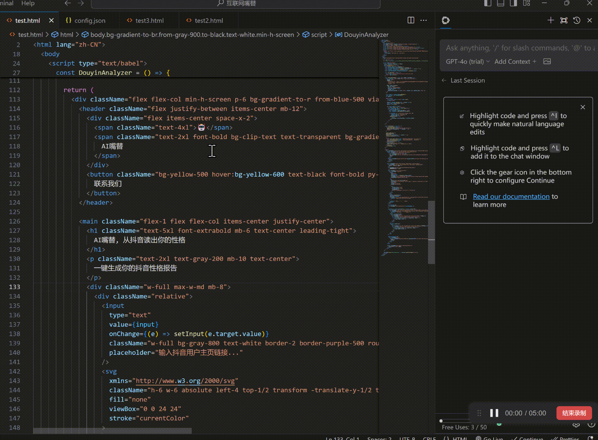
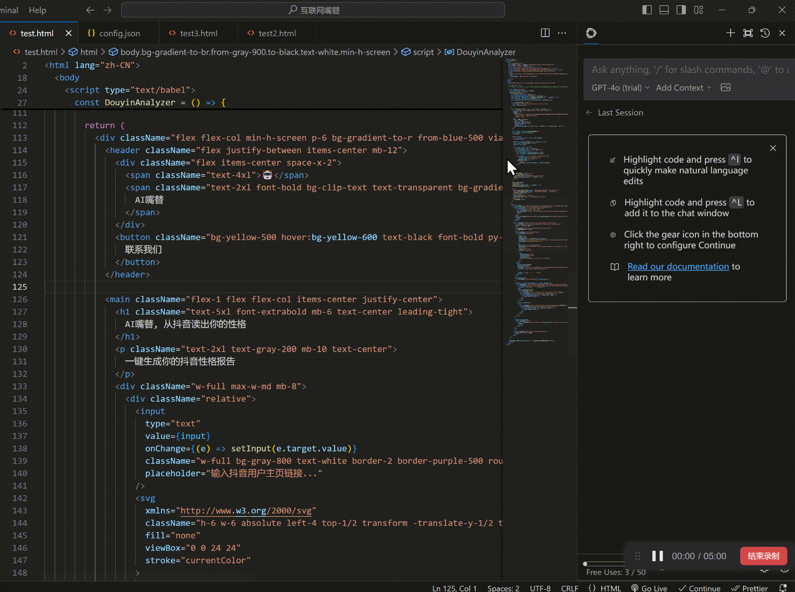
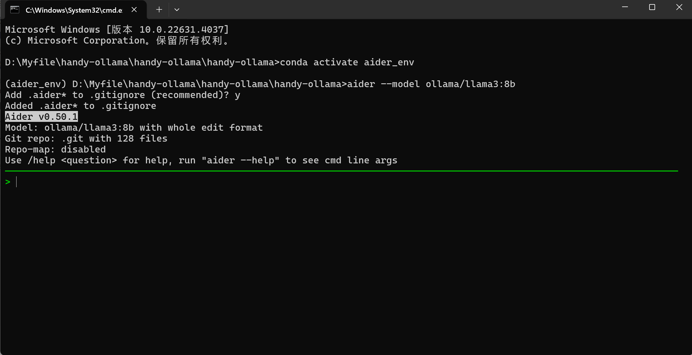
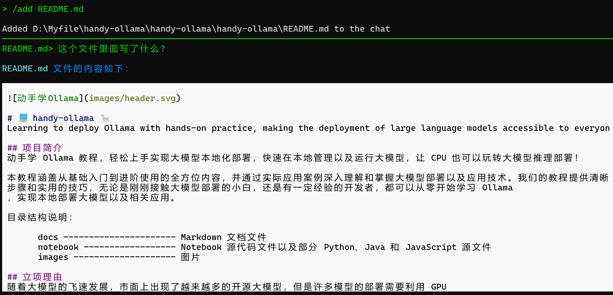

#  搭建本地的 AI Copilot 编程助手

> 本节课你将学会：
>
> 1. 使用ollama集成本地编程助手，其中包括
>
>    - continue
>    - aider
>    
>我们讲主要讲解vscode的安装和基本使用方式。jetbrain使用方式和vscode大同小异，参考vscode即可。

## 一、AI编程介绍

### 1.1  为什么我们要使用ai编程？

大语言模型问世已久，但是其表现最出色的领域一直是编程领域，原因如下：

1. **明确的对错标准。** 在编程世界里,代码要么能跑,要么不能。这种非黑即白的特性让 AI 更容易判断自己的输出质量。
2. **精确的语言。** 编程语言没有太多模棱两可的地方。每个符号、每个关键字都有明确的含义。这种精确性正是 AI 模型所擅长的。
3. **目标明确的任务。** 写代码时,我们通常有明确的目标。比如,"写一个计算斐波那契数列的函数"。这种清晰的指令让 AI 更容易集中精力解决问题。
4. **知识的通用性。** 学会了一种编程语言的基本概念,很多东西都能迁移到其他语言。这种知识的可迁移性让 AI 模型在编程领域学习效率特别高。

### 1.2 我们如何使用ai编程？

1. 使用大模型对话应用（这里不再讲解）
2. 使用集成开发环境（IDE）
   - continue
3. 使用命令行工具
   - aider

## 二、 集成开发环境continue接入

### 2.1 安装所需模型

1. 安装ollama
2. 安装以下模型
   - 安装通用问答模型`ollama pull llama3:8b`
   - 安装自动代码补全模型: `ollama pull starcoder2:3b`
   - 安装embedding模型: `ollama pull nomic-embed-text`

### 2.2 在vscode安装Continue以及配置本地ollama

1. 在vscode插件库安装模型

   搜索Continue，看到如下的图标，点击install或者安装

   

2. （推荐操作）强烈建议将“继续”移至 VS Code 的右侧边栏。这有助于在使用“继续”时保持文件资源管理器打开，并且可以使用简单的键盘快捷键切换侧边栏。

   

3. 配置ollama

   方式1：点击Select model----选择Add model----点击Ollama----选择Autodetect

   这样，就可以自动选择刚刚我们在ollama上下载好的模型进行代码推理工具了。

   

   

   方式2：点击如图所示的设置按钮，进入配置页面，粘贴如下配置

   ``` typescript
   {
     "models": [
       {
         "title": "Ollama",
         "provider": "ollama",
         "model": "AUTODETECT"
       }
     ],
     "tabAutocompleteModel": {
       "title": "Starcoder 2 3b",
       "provider": "ollama",
       "model": "starcoder2:3b"
     },
     "embeddingsProvider": {
       "provider": "ollama",
       "model": "nomic-embed-text"
     }
   }
   ```
   
   
   

### 2.3 基本使用指南

1. **轻松理解代码**


- VS Code: `cmd+L` (MacOS) / `ctrl+L` (Windows)
  VS 代码： `cmd+L` (MacOS) / `ctrl+L` (Windows)
- JetBrains: `cmd+J` (MacOS) / `ctrl+J` (Windows)
  JetBrains： `cmd+J` (MacOS) / `ctrl+J` (Windows)

2. **使用Tab键自动完成代码**


- VS Code: `tab` (MacOS) / `tab` (Windows)
  VS Code： `tab` (MacOS) / `tab` (Windows)
- JetBrains: `tab` (MacOS) / `tab` (Windows)
  JetBrains： `tab` (MacOS) / `tab` (Windows)

3. **重构你的函数**


- VS Code: `cmd+I` (MacOS) / `ctrl+I` (Windows)
  VS 代码： `cmd+I` (MacOS) / `ctrl+I` (Windows)
- JetBrains: `cmd+I` (MacOS) / `ctrl+I` (Windows)
  JetBrains： `cmd+I` (MacOS) / `ctrl+I` (Windows)

3. **询问有关您的[代码库](https://docs.continue.dev/how-to-use-continue#ask-questions-about-your-codebase)的问题**



- VS Code: `@codebase` (MacOS) / `@codebase` (Windows)
  VS Code： `@codebase` (MacOS) / `@codebase` (Windows)
- JetBrains: Support coming soon
  JetBrains：即将提供支持

4. **快速使用文档作为上下文**



- VS Code: `@docs` (MacOS) / `@docs` (Windows)
  VS 代码： `@docs` (MacOS) / `@docs` (Windows)
- JetBrains: `@docs` (MacOS) / `@docs` (Windows)
  JetBrains： `@docs` (MacOS) / `@docs` (Windows)

5. **使用斜杠命令开始操作**



- VS Code: `/edit` (MacOS) / `/edit` (Windows)
  VS Code： `/edit` (MacOS) / `/edit` (Windows)
- JetBrains: `/edit` (MacOS) / `/edit` (Windows)
  JetBrains： `/edit` (MacOS) / `/edit` (Windows)

Learn more about slash commands [here](https://docs.continue.dev/customization/slash-commands)
[在此处](https://docs.continue.dev/customization/slash-commands)了解有关斜杠命令的更多信息

6. **将类、文件等添加到[上下文](https://docs.continue.dev/how-to-use-continue#add-classes-files-and-more-to-context)中**


- VS Code: `@files` (MacOS) / `@files` (Windows)
  VS 代码： `@files` (MacOS) / `@files` (Windows)
- JetBrains: `@files` (MacOS) / `@files` (Windows)
  JetBrains： `@files` (MacOS) / `@files` (Windows)

Learn more about context providers [here](https://docs.continue.dev/customization/context-providers).
[在此处](https://docs.continue.dev/customization/context-providers)了解有关上下文提供程序的更多信息。

7. **了解终端错误**


- VS Code: `cmd+shift+R` (MacOS) / `ctrl+shift+R` (Windows)
  VS 代码： `cmd+shift+R` (MacOS) / `ctrl+shift+R` (Windows)
- JetBrains: Support coming soon
- JetBrains：即将提供支持

### 2.4  参考资料

官方网站：https://docs.continue.dev/intro

## 三、命令行环境AIder接入

aider是基于命令行的编程助手，比起集成开发环境，它拥有顶级的系统权限和功能使用，但同时意味着它更难上手。

以下教程将教会你安装aider以及连接到ollama服务

此外，请确保：

1. 安装了git并且有git使用经验
2. python使用经验

### 3.1 安装AIder

1. aider过程中对python环境有大量依赖，建议使用conda新开一个环境或者使用python新建虚拟环境，以下使用conda演示

   - 新起一个conda虚拟环境（python虚拟环境同理）

     ``` pyth
     conda create -n aider_env python=3.9
     ```

   - 进入该虚拟环境

     ``` 
     conda activate aider_env
     ```

   - 按照以下命令安装

     ```
     python -m pip install aider-chat
     ```

### 3.2 设置ollama并启动

1. 启动命令行，按照如下设置环境变量	

   ``` 
   export OLLAMA_API_BASE=http://127.0.0.1:11434 # Mac/Linux环境
   setx   OLLAMA_API_BASE http://127.0.0.1:11434 # Windows环境,设置以后重启shell工具
   ```

2. cd进入自己本地的代码仓库位置，若没有，aider会自动在当前目录下初始化git仓库

   ``` 
   #example 
   cd D:\Myfile\handy-ollama\handy-ollama\handy-ollama
   ```

3. 使用以下命令运行aider

   ``` powershell
   aider --model ollama/<你的模型名字>
   #example
   #aider --model ollama/llama3:8b
   ```

4. 进入以下页面即成功

   

5. 你现在可以跟他聊天，或者给他发送一些指令，它可以直接修改你的代码！

   

### 3.3 基本使用

1. 你可以问它一些关于这个仓库的基本信息

   

2. Add Files添加文件

   ``` 
   /add <file1> <file2> ...
   ```

   然后你就可以根据这些文件来做一些提问

   - 您可以在不添加任何文件的情况下使用aider，它会根据您的请求尝试找出需要编辑哪些文件。
   - 仅添加需要为你的任务编辑的文件。不要添加一堆额外的文件。如果添加太多文件，LLM可能会变得不知所措和困惑（并且需要花费更多代币）。 Aider 会自动从相关文件中提取内容，以便它能够[理解代码库的其余部分](https://aider.chat/docs/repomap.html)。

   示例：

   

   

   

3. 使用/drop删除所有添加入的文件

更多用法请参照https://aider.chat/docs/usage.html

